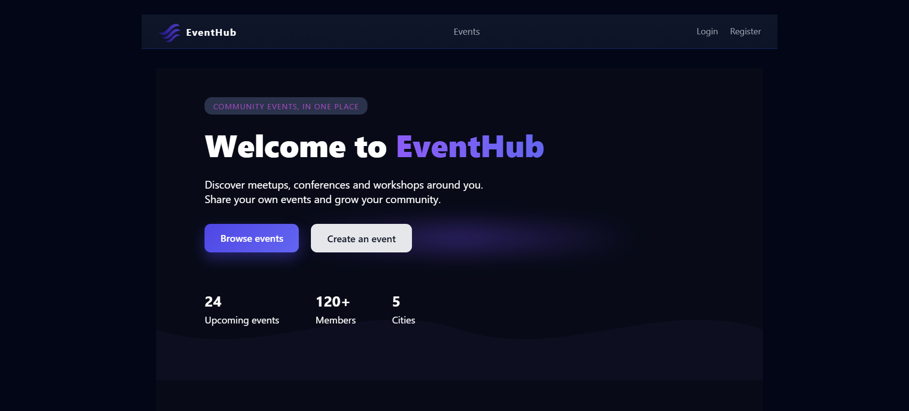
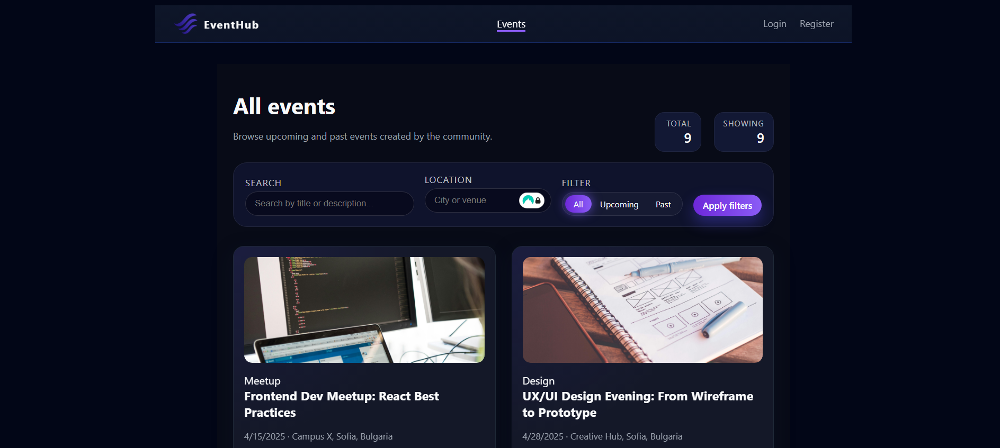
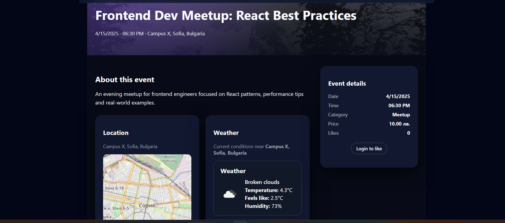
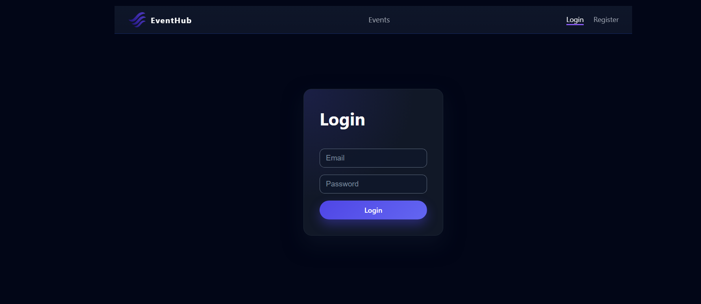
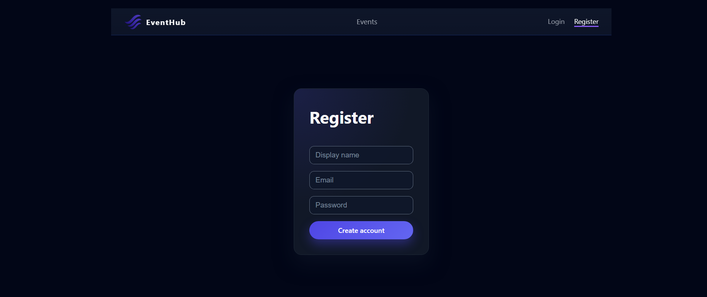

# 🎉 **EventHub**

EventHub is a full-stack event management platform built with **ASP.NET Core Web API**, **React + TypeScript**, and **SQL Server**, featuring authentication, event CRUD operations, likes, comments, weather/map integrations, and deployment on **Microsoft Azure**.

---

## 📚 Documentation
🔗 [API Reference](./API.md)

## 📑 **Table of Contents**
1. [Tech Stack](#-tech-stack)  
2. [Features](#-features)  
3. [Architecture](#-architecture)  
4. [Project Structure](#-project-structure)  
5. [API Endpoints](#-api-endpoints)  
   - [Authentication](#authentication)  
   - [Events](#events)  
   - [Comments](#comments)  
   - [Likes](#likes)  
6. [Installation](#-installation)  
7. [Backend Setup](#backend-setup-api)  
8. [Frontend Setup](#frontend-setup-react)  
9. [Deployment Instructions](#-deployment-instructions)  
10. [Environment Variables](#environment-variables)
11. [Screenshots](#-screenshots)  
12. [License](#-license)

---

# 🚀 **Tech Stack**

### **Backend**


### **Frontend**


### **Cloud**


---

# 📦 **Features**

- 🔐 **JWT Authentication** with Email Confirmation  
- 👤 **User Profiles & Login System**  
- 📝 **Event CRUD** (create, edit, delete — only by author)  
- 👍 **Like System**  
- 💬 **Comment System**  
- 🗺️ **Map Integration** – Leaflet + OpenStreetMap  
- 🌦️ **Weather Integration** – OpenWeather API  
- 📱 **Responsive UI**  
- ☁️ **Azure Deployment** (API + SQL + Static Web App)  

---

# 🧱 **Architecture**

```text
 ┌──────────────────────────┐
 │        React App         │
 │  Vite • TS • Context     │
 └───────────▲──────────────┘
             │ REST API
 ┌───────────┴──────────────┐
 │     ASP.NET Core API     │
 │  Controllers • JWT Auth  │
 └───────────▲──────────────┘
             │ EntityFramework
 ┌───────────┴──────────────┐
 │        SQL Server        │
 │  Azure SQL Database      │
 └──────────────────────────┘
```

---

# 📁 **Project Structure**

```text
/EventHub.Api       → ASP.NET Core Web API  
/web                → React + Vite frontend  
```

---

# 🔌 **API Endpoints**

> Full details live in [`API.md`](./API.md). Below is a short summary.

## 🔐 Authentication

| Method | Endpoint              | Description               |
|--------|-----------------------|---------------------------|
| POST   | `/api/auth/register`  | Register new user         |
| POST   | `/api/auth/login`     | Login & receive JWT       |
| POST   | `/api/auth/confirm`   | Confirm email             |

## 📅 Events

| Method | Endpoint                | Description                         |
|--------|-------------------------|-------------------------------------|
| GET    | `/api/events`           | Get all events                      |
| GET    | `/api/events/{id}`      | Get event by ID                     |
| POST   | `/api/events`           | Create *(auth required)*           |
| PUT    | `/api/events/{id}`      | Update *(author only)*             |
| DELETE | `/api/events/{id}`      | Delete *(author only)*             |
| POST   | `/api/events/{id}/like` | Toggle like *(auth required)*      |

## 💬 Comments

| Method | Endpoint                                  | Description                         |
|--------|-------------------------------------------|-------------------------------------|
| GET    | `/api/events/{id}/comments`              | Get comments for event              |
| POST   | `/api/events/{id}/comments`              | Add comment *(auth required)*      |
| DELETE | `/api/events/{eventId}/comments/{id}`    | Delete comment *(author only)*     |

---

# 🛠️ Installation

## 1️⃣ Clone the repository

```bash
git clone https://github.com/<your-username>/EventHub.git
cd EventHub
```

---

# 🗄️ Backend Setup (API)

## 2️⃣ Restore packages

```bash
cd EventHub.Api
dotnet restore
```

## 3️⃣ Configure `appsettings.json`

```json
{
  "ConnectionStrings": {
    "DefaultConnection": "Server=.;Database=EventHub;Trusted_Connection=True;TrustServerCertificate=True;"
  },
  "Jwt": {
    "Key": "your-secret-key"
  }
}
```

## 4️⃣ Apply database migrations

```bash
dotnet ef database update
```

## 5️⃣ Run the API

```bash
dotnet run
```

Swagger (local): `https://localhost:<port>/swagger`  
Swagger (Azure): `https://eventhubapi-hehvaravgzcpbdf5.canadacentral-01.azurewebsites.net/swagger`

---

# 🌐 Frontend Setup (React)

## 6️⃣ Install dependencies

```bash
cd web
npm install
```

## 7️⃣ Create `.env`

```env
VITE_API_URL=https://localhost:7132
VITE_OPENWEATHER_KEY=your-openweather-api-key
```

## 8️⃣ Run the frontend

```bash
npm run dev
```

Local: `http://localhost:5173`  
Azure Static Web App: `https://<your-static-web-app>.azurestaticapps.net/`

---

# ☁️ Deployment Instructions

## 🔵 Deploy API to Azure App Service

1. Create an **App Service** with runtime **.NET 8 (LTS)**  
2. Configure **Connection Strings** and **App Settings**:  

   - `ConnectionStrings__DefaultConnection`  
   - `Jwt__Key`  

3. Publish from Visual Studio or `dotnet publish` + zip deploy  
4. Restart the App Service

---

## 🟦 Deploy Frontend to Azure Static Web Apps

Example GitHub Actions config:

```yml
app_location: "web"
api_location: ""
output_location: "dist"
```

Build command: `npm run build`

---

# 🌱 Environment Variables

## Backend

```text
ConnectionStrings__DefaultConnection=...
Jwt__Key=...
```

## Frontend

```text
VITE_API_URL=...
VITE_OPENWEATHER_KEY=...
```

## 📸 Screenshots
### Home


### Events Catalog


### Event Details


### Login


### Register


# 📄 License

MIT License © 2025

---

# 🙌 Author

Built by **Angel** as a full‑stack web development project.
